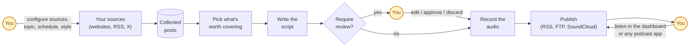

# Selected GitHub Repositories

These are the current repos selected for the personalized GitHub-to-podcast loop.

## 2026-07-09 production picks

These repositories filled the 2026-07-09 quota as single-repository episodes:

| Repository | Local commit | Fit role |
| --- | --- | --- |
| `unclecode/crawl4ai` | `987541e` | Open-source LLM-friendly web crawler and scraper for turning public docs, websites, and dynamic pages into Markdown and structured context. |
| `mem0ai/mem0` | `b26469e` | Agent memory layer with ADD-only fact extraction, entity linking, hybrid retrieval, temporal reasoning, SDKs, CLI, self-hosting, and agent skills. |
| `supermemoryai/supermemory` | `97888ce` | Cross-client AI memory and context platform for user profiles, hybrid search, connectors, MCP tools, browser extension, and personal/company brain workflows. |
| `browserbase/stagehand` | `be0a2f6` | AI browser automation framework that blends deterministic code, natural-language actions, schema extraction, caching, self-healing, logs, and evals. |
| `ComposioHQ/composio` | `914bccf` | Agent tool-integration SDK and MCP direction for safely connecting OpenAI, Anthropic, LangChain, LangGraph, LlamaIndex, CrewAI, AutoGen, and real apps. |

## 2026-07-08 production picks

These repositories filled the 2026-07-08 quota as single-repository episodes:

| Repository | Local commit | Fit role |
| --- | --- | --- |
| `OpenHands/OpenHands` | `ede3d75` | Self-hosted developer control center for coding agents, automations, multi-backend execution, and agent productization. |
| `microsoft/markitdown` | `e144e0a` | Document-to-Markdown ingestion layer for LLM workflows across Office, PDF, HTML, audio, images, ZIPs, and MCP tools. |
| `getzep/graphiti` | `dfb742d` | Temporal context graph and agent memory engine for evolving Feishu/Daily facts, provenance, and current-state queries. |
| `firecrawl/firecrawl` | `cb3d902` | Web search/scrape/interact ingestion service for turning messy web pages into LLM-ready Markdown and structured data. |
| `n8n-io/n8n` | `dc057206` | Workflow automation platform for AI agents, business integrations, human approval, observability, and production delivery. |

## 2026-07-07 production picks

These repositories filled the 2026-07-07 quota as single-repository episodes:

| Repository | Local commit | Fit role |
| --- | --- | --- |
| `openai/codex` | `cca16a1` | OpenAI coding-agent architecture reference for CLI, desktop app, threads, tools, sandboxing, skills, plugins, and MCP. |
| `anthropics/claude-code` | `7930e1c` | Claude Code plugin/workflow reference for commands, agents, skills, hooks, and repeatable AI work systems. |
| `anthropics/claude-code-action` | `f87768c` | GitHub Actions bridge for Claude Code automation, PR/issue triggers, permissions, structured outputs, and runner safety. |
| `larksuite/cli` | `f0b6f35` | Official Feishu/Lark CLI for agent-native Docs, Daily, Base, Calendar, Tasks, Mail, and workflow automation. |
| `larksuite/lark-openapi-mcp` | `2192035` | Official Feishu/Lark MCP bridge for exposing OpenAPI tools to Claude, Codex, Cursor, and other agents. |

## 2026-07-06 production picks

These repositories filled the 2026-07-06 quota as single-repository episodes:

| Repository | Local commit | Fit role |
| --- | --- | --- |
| `niuz3199-collab/Morning-news-podcast` | `edc03b2` | Android news-to-audio product reference for daily briefing, MiMo TTS, logging, and mobile listening. |
| `yamadashy/repomix` | `d8d3f65` | Repository-to-AI-context packer for deeper single-repo scripts and token/security gates. |
| `browser-use/browser-use` | `18484f2` | Browser execution layer for coding agents, GitHub evidence collection, and Feishu workflow automation. |
| `microsoft/playwright-mcp` | `36ec986` | MCP browser automation server for structured web interaction and complex page-state workflows. |
| `DIYgod/RSSHub` | `f8d0a14` | RSS route infrastructure reference for a durable personal repo/news radar input layer. |

## gitingest

- Remote: https://github.com/coderamp-labs/gitingest.git
- Local commit: `4e259a0`
- Role: Turn a Git repository into prompt-friendly LLM context.

Top-level evidence:

```text
.docker/minio/setup.sh
.dockerignore
.env.example
.github/ISSUE_TEMPLATE/bug_report.yml
.github/ISSUE_TEMPLATE/feature_request.yml
.github/workflows/ci.yml
.github/workflows/codeql.yml
.github/workflows/dependency-review.yml
.github/workflows/deploy-pr.yml
.github/workflows/docker-build.ecr.yml
.github/workflows/docker-build.ghcr.yml
.github/workflows/pr-title-check.yml
.github/workflows/publish_to_pypi.yml
.github/workflows/rebase-needed.yml
.github/workflows/release-please.yml
.github/workflows/scorecard.yml
.github/workflows/stale.yml
.gitignore
.pre-commit-config.yaml
.release-please-manifest.json
.vscode/launch.json
CHANGELOG.md
CODE_OF_CONDUCT.md
CONTRIBUTING.md
Dockerfile
LICENSE
README.md
SECURITY.md
compose.yml
docs/frontpage.png
```

README excerpt:

```text
# Gitingest

[](https://gitingest.com)

<!-- Badges -->
<!-- markdownlint-disable MD033 -->
<p align="center">
  <!-- row 1 — install & compat -->
  <a href="https://pypi.org/project/gitingest"></a>
  <a href="https://pypi.org/project/gitingest"></a>
  <br>
  <!-- row 2 — quality & community -->
  <a href="https://github.com/coderamp-labs/gitingest/actions/workflows/ci.yml?query=branch%3Amain"></a>

  <a href="https://github.com/astral-sh/ruff"></a>
  <a href="https://scorecard.dev/viewer/?uri=github.com/coderamp-labs/gitingest"></a>
  <br>
  <a href="https://github.com/coderamp-labs/gitingest/blob/main/LICENSE"></a>
  <a href="https://pepy.tech/project/gitingest"></a>
  <a href="https://github.com/coderamp-labs/gitingest"></a>
  <a href="https://discord.com/invite/zerRaGK9EC"></a>
  <br>
  <a href="ht
```

## Audicle

- Remote: https://github.com/ttlequals0/Audicle.git
- Local commit: `f7be982`
- Role: Turn saved articles and documents into a private podcast feed.

Top-level evidence:

```text
.dockerignore
.env.example
.github/dependabot.yml
.github/scripts/check_chatterbox.py
.github/workflows/chatterbox-monitor.yml
.github/workflows/dependency-review.yml
.gitignore
CHANGELOG.md
Dockerfile
LICENSE
README.md
THIRD_PARTY_NOTICES.md
VERSION
backend/app/__init__.py
backend/app/api/__init__.py
backend/app/api/access_log.py
backend/app/api/deps.py
backend/app/api/errors.py
backend/app/api/health.py
backend/app/api/media.py
backend/app/api/rss.py
backend/app/api/v1/__init__.py
backend/app/api/v1/auth.py
backend/app/api/v1/chime.py
backend/app/api/v1/corrections.py
backend/app/api/v1/episodes.py
backend/app/api/v1/feed.py
backend/app/api/v1/feed_auth.py
backend/app/api/v1/jobs.py
backend/app/api/v1/llm.py
```

README excerpt:

```text
<p align="center">
  
</p>

# Audicle

Self-hosted Podcasting 2.0 service that turns saved articles into a personal podcast feed.

Paste a URL or upload a document (PDF, DOCX, Markdown, text, or HTML), wait a few minutes, and get an episode with cloned-voice narration, artwork, and a WebVTT transcript. Subscribe in Pocket Casts, Overcast, or Apple Podcasts like any other show.

*Your reading list, as a podcast you own.*

## Contents

- [Screenshots](#screenshots)
- [Sample](#sample)
- [Why](#why)
- [What's in the repo](#whats-in-the-repo)
- [Quickstart](#quickstart)
- [Required env vars](#required-env-vars)
- [Valid iTunes categories](#valid-itunes-categories)
- [Voices](#voices)
- [End-of-episode chime](#end-of-episode-chime)
- [Episode artwork](#episode-artwork)
- [Pronunciation corrections](#pronunciation-corrections)
- [Webhooks](#webhooks)
- [Paywalled articles](#paywalled-articles)
  - [Subscriber paywalls (cookie jar)](#subscriber-paywalls-cookie-jar)
- [Licensing notes](#licensing-notes)
- [Architecture](#architecture)
  - [TTS verification](#tts-verification)
- [Operating](#operating)
- [Development](#development)
- [LLM Disclosure](#llm-disclosure)
- [Credits](#credits)

## Screenshots

Home -- paste a URL or upload a file, and it joins the feed.

<p align="center">
  
  
</p>

Feed -- your episodes with inline players, transcripts, and per-episode actions.

<p align="center">
  
  
</p>

Settings -- provide
```

## ai-podcast-studio

- Remote: https://github.com/sourcelabs-nl/ai-podcast-studio.git
- Local commit: `b16501c`
- Role: Monitor sources, score relevance, compose scripts, synthesize audio, and publish RSS.

Top-level evidence:

```text
.claude/agents/code-reviewer.md
.claude/rules/application-yaml.md
.claude/rules/controllers.md
.claude/rules/entities.md
.claude/rules/migrations.md
.claude/rules/repositories.md
.claude/rules/schedulers.md
.claude/rules/tests.md
.claude/settings.json
.claude/skills/architecture/SKILL.md
.claude/skills/code-review/SKILL.md
.claude/skills/database-design/SKILL.md
.claude/skills/flyway-migration/SKILL.md
.claude/skills/jackson-migration/SKILL.md
.claude/skills/kotlin-quality/SKILL.md
.claude/skills/openspec-apply-change/SKILL.md
.claude/skills/openspec-archive-change/SKILL.md
.claude/skills/openspec-bulk-archive-change/SKILL.md
.claude/skills/openspec-continue-change/SKILL.md
.claude/skills/openspec-drift-check/SKILL.md
.claude/skills/openspec-explore/SKILL.md
.claude/skills/openspec-ff-change/SKILL.md
.claude/skills/openspec-new-change/SKILL.md
.claude/skills/openspec-onboard/SKILL.md
.claude/skills/openspec-sync-specs/SKILL.md
.claude/skills/openspec-verify-change/SKILL.md
.claude/skills/readme-structure/SKILL.md
.claude/skills/spring-ai/SKILL.md
.claude/skills/spring-boot/SKILL.md
.claude/skills/spring-data-jdbc/SKILL.md
```

README excerpt:

```text
# AI Podcast Studio

Self-hosted pipeline that monitors content sources (websites, RSS feeds, X accounts), filters and summarizes relevant content using an LLM, converts the summaries to audio via TTS, and delivers them as a podcast feed consumable by any podcast app.

Hear it in action: [The Agentic AI Podcast on Spotify](https://open.spotify.com/show/3sNWski1Zw9mGauajOdToS?si=ebd2ba77b3dc4f38), a daily briefing produced entirely by this project.

## How It Works

### The big picture

You point the app at a handful of websites, RSS feeds, and X accounts that you care about. In the background it keeps an eye on them and collects new posts as they appear. On a schedule you choose (say, every morning at 6), it reads through everything new, decides what's actually worth talking about, writes a podcast script in your preferred style, optionally pauses for you to review/edit it, records it as audio, and publishes the episode so any podcast app can subscribe. You can listen to the finished episode straight from the dashboard.



If anything goes wrong partway through, the app remembers exactly where it got stuck and you can resume from that point wi
```

## feishu-pm-kit

- Remote: https://github.com/Winfred1024/feishu-pm-kit.git
- Local commit: `6609f9a`
- Role: Productized Feishu project-manager agent built around Claude Code and Lark CLI.

Top-level evidence:

```text
.github/workflows/tests.yml
.gitignore
LICENSE
README.md
docs/plans/2026-05-21-feishu-pm-kit.md
docs/specs/2026-05-21-feishu-pm-kit-design.md
docs/部署清单.md
engine/__init__.py
engine/bitable_sync.py
engine/bootstrap.py
engine/feishu.py
engine/gen_index.py
engine/health.py
engine/lib/__init__.py
engine/lib/config.py
engine/lib/frontmatter.py
engine/lib/lark.py
instances/.gitkeep
pytest.ini
requirements.txt
templates/.gitkeep
templates/CLAUDE.md.tmpl
templates/config.example.yaml
templates/说明.md.tmpl
templates/项目档案模板.md
tests/.gitkeep
tests/fixtures/.gitkeep
tests/fixtures/instance/config.yaml
tests/fixtures/instance/项目档案/QXCDC2600001_demo.md
tests/test_bitable_sync.py
```

README excerpt:

```text
# feishu-pm-kit

[](https://github.com/Winfred1024/feishu-pm-kit/actions/workflows/tests.yml)
[](LICENSE)
[](https://www.python.org/)
[](https://github.com/Winfred1024/feishu-pm-kit/commits/main)

> 可快速部署到飞书的 **AI 项目经理 Agent + 项目管理系统** 部署套件。
> 一份共享引擎驱动多个团队实例,新团队"加一份 config + 跑一条 bootstrap"即可上线。

## 这是什么

把"**Claude Code 本体 + `CLAUDE.md` 操作手册 + `lark-cli` 飞书通道**"这一已验证的 AI 项目经理模式产品化:

- **Agent 项目经理**:在飞书业务群里监听消息、@责任人跟进、识别风险、发日报。Agent 本体是 Claude Code,在实例目录启动即加载该实例的 `CLAUDE.md`,化身那个团队的项目经理。
- **项目管理系统**:项目档案以 markdown frontmatter 为唯一事实源,脚本生成索引 + 健康看板,并做四项治理校验;可单向镜像到飞书多维表格供团队查看。

## 架构(共享引擎 + 多实例配置)

```
feishu-pm-kit/
├── engine/            # 共享引擎(唯一一份代码)
│   ├── lib/           # config / frontmatter / lark 调用封装
│   ├── gen_index.py   # 索引生成 + 四项治理校验
│   ├── feishu.py      # 飞书通道:poll / send / ws-start|stop|status
│   ├── bitable_sync.py# 项目台账单向同步到飞书多维表格(Base)
│   ├── bootstrap.py   # 一键部署:脚手架 / 拉成员 / 建表 / 渲染 CLAUDE.md
│   └── health.py      # WebSocket 健康检查 + 自动重启
├── templates/         # 实例脚手架(config.example / CLAUDE.md / 项目档案模板 …)
├── instances/         # 各团队实例(每个 = 一份 config.yaml + 数据目录;不入库)
├── tests/             # pytest 测试
└── docs/              # 设计文档(spec / plan)+ 部署清单
```

引擎默认作用于当前实例目录(`--instance PATH` 可覆盖);运行时状态(轮询断点、WS 事件流)写实例内 `.state/`。**全部团队差异进 `config.yaml`,引擎零硬编码。**

## 依赖

- Python 3.10+、`pyyaml`
- [`@larksuite/cli`](https://www.npmjs.com/package/@larksuite/cli)(飞书/Lark 官方 CLI,`npm i -g @larksuite/cli`),凭据用 `lark-cli config init`,多实例用 `--profile
```

## feishu-claude-code

- Remote: https://github.com/H2O-YAOZE/feishu-claude-code.git
- Local commit: `70d35cb`
- Role: Use Feishu as a remote control for Claude Code running on the user's computer.

Top-level evidence:

```text
.env.example
.gitignore
CLAUDE.md
LICENSE
README.md
TROUBLESHOOTING.md
bot_config.py
bug/2026-06-02-httpx-connecterror.md
claude_runner.py
commands.py
deploy/feishu-claude.plist
feishu_client.py
health_check.sh
main.py
migrate_sessions.py
pyproject.toml
requirements.txt
run_control.py
session_store.py
start_bridge.bat
tests/test_claude_runner.py
tests/test_concurrent_groups.py
tests/test_group_chat.py
tests/test_integration.py
tests/test_main_stop.py
tests/test_run_control.py
tests/test_session_store.py
tests/test_workspace_commands.py
```

README excerpt:

```text
# feishu-claude-code

> 飞书是遥控器，Claude Code 是在你电脑上真实干活的那只手。出门在外发一条飞书消息，电脑那边就开始跑代码、改文件、读文档。

## 与同类项目的差异

| 能力 | 原版 feishu-claude-code | 本项目 |
|---|---|---|
| 文本/图片消息 | ✅ | ✅ |
| 富文本/转发消息 | ❌ | ✅ |
| 文件消息 (PDF/Word 等) | ❌ | ✅ 自动下载后分析 |
| 语音消息 | ❌ | ✅ 下载到本地 |
| 文档链接自动解析 | ❌ | ✅ 自动取内容嵌入上下文 |
| 长回复 (>200字) | 流式卡片慢 | ✅ 自动生成飞书文档 |
| 文档评论 @回复 | ✅ | ✅ |
| 休眠唤醒自动重连 | ❌ | ✅ |
| 日志噪音过滤 | ❌ | ✅ |
| 外部文档安全边界 | ❌ | ✅ |
| [[SEND_FILE]] 文件回传 | ✅ | ✅ |

## 特性

**消息类型全覆盖**
- 文本、富文本 (post)、图片、文件 (PDF/Word/Excel/压缩包)、语音 (audio)、转发 (merge_forward)
- 群聊 @机器人 触发，私聊直接对话

**飞书文档深度集成**
- 文档链接自动识别并获取内容（docx/wiki/sheets/base/mindnotes/minutes）
- 长回复自动写入飞书文档，聊天里只发链接
- 文档评论 @机器人 自动回复
- ⚠️ 隐私提醒：Bot 会自动读取你发送的文档链接内容。群聊中请勿发送含敏感信息的文档链接。

**文件回传**
- Claude 生成的文件自动上传到飞书 Drive，返回下载链接
- 在回复中写 `[[SEND_FILE:./report.md]]` 即可触发
- 支持图片、文档、PDF、Excel 等任意文件类型

**流式卡片输出**
- Claude 实时思考过程可见
- 工具调用进度实时展示
- 支持卡片按钮交互（选项选择、模式切换）

**Session 管理**
- 跨设备恢复会话（手机上开始，电脑前继续）
- 群聊独立 session，互不干扰
- `/ws` 为不同群绑定不同工作目录

**运维健壮**
- 笔记本休眠唤醒自动重连
- DNS/网络抖动自动恢复
- launchd (macOS) / 启动脚本 (Windows) 保活

## 架构

```
┌──────────┐  WebSocket  ┌────────────────┐  subprocess  ┌────────────┐
│  飞书 App │◄───────────►│ feishu-bridge   │─────────────►│ claude CLI │
│  (用户)   │  长连接      │  (main.py)      │ stream-json  │  (本机)     │
└──────────┘             └────────────────┘              └────────────┘
                                │
                                │ subprocess (--as user)
                                ▼
                         ┌────────────┐
                         │  lark-cli   │  ← 用户 token，文档/文件/IM 操作
                         └────────────┘
```

关键设计决策：
- **收消息走 lark-cli WebSocket**：App 鉴权，不暴露公网端口
- **发消息走 Python SDK (lark_oapi)**：租户 token，流式卡片 patch
- **文档操作走 lark-cli**：用户 token，直接以用户身份读写文档，无需额外授权

## 快速开始

### 前置条件

| 依赖
```

## Morning-news-podcast

- Remote: https://github.com/niuz3199-collab/Morning-news-podcast.git
- Local commit: `edc03b2`
- Role: Android daily news audio briefing with LLM script generation and TTS.

Top-level evidence:

```text
LICENSE
README.md
app/build.gradle.kts
app/proguard-rules.pro
app/src/main/AndroidManifest.xml
app/src/main/java/com/morningnewspodcast/MainActivity.kt
app/src/main/java/com/morningnewspodcast/MorningNewsApplication.kt
app/src/main/java/com/morningnewspodcast/data/local/AppDatabase.kt
app/src/main/java/com/morningnewspodcast/data/local/BroadcastAudioDao.kt
app/src/main/java/com/morningnewspodcast/data/local/BroadcastScriptDao.kt
app/src/main/java/com/morningnewspodcast/data/local/ConfigDao.kt
app/src/main/java/com/morningnewspodcast/data/local/Converters.kt
app/src/main/java/com/morningnewspodcast/data/local/NewsItemDao.kt
app/src/main/java/com/morningnewspodcast/data/local/entities/BroadcastAudioEntity.kt
app/src/main/java/com/morningnewspodcast/data/local/entities/BroadcastScriptEntity.kt
app/src/main/java/com/morningnewspodcast/data/local/entities/ConfigEntity.kt
app/src/main/java/com/morningnewspodcast/data/local/entities/NewsItemEntity.kt
app/src/main/java/com/morningnewspodcast/data/model/BroadcastAudio.kt
app/src/main/java/com/morningnewspodcast/data/model/BroadcastConfig.kt
app/src/main/java/com/morningnewspodcast/data/model/BroadcastScript.kt
app/src/main/java/com/morningnewspodcast/data/model/NewsCategory.kt
app/src/main/java/com/morningnewspodcast/data/model/NewsItem.kt
app/src/main/java/com/morningnewspodcast/data/model/NewsSource.kt
app/src/main/java/com/morningnewspodcast/data/remote/DeepSeekApiService.kt
app/src/main/java/com/morningnewspodcast/data/remote/MiMoTtsService.kt
app/src/main/java/com/morningnewspodcast/data/remote/NewsRssService.kt
app/src/main/java/com/morningnewspodcast/data/remote/WorldNewsApiClient.kt
app/src/main/java/com/morningnewspodcast/data/repository/BroadcastRepository.kt
app/src/main/java/com/morningnewspodcast/data/repository/NewsRepository.kt
app/src/main/java/com/morningnewspodcast/di/AppModule.kt
```

README excerpt:

```text
# 晨间新闻播报 (Morning News Podcast)

一个 Android 原生应用，自动抓取多源新闻，用大语言模型生成播报文稿，再用 TTS 合成语音播报。每天早上为你准备一份音频新闻简报。

## 功能

- **多源新闻聚合**：RSS / RSS2JSON / World News API，覆盖国内、国际、城市、科技、AI 等领域
- **AI 文稿生成**：支持 DeepSeek、阶跃星辰 Step Plan 及任何 OpenAI 兼容协议的 LLM
- **语音合成**：支持小米 MiMo TTS 及任何 OpenAI chat-completions 兼容的 TTS 服务
- **来源审计**：新闻列表按来源筛选，查看每个源的出稿数量
- **定时生成**：WorkManager 后台定时任务，每天自动生成播报
- **播放器**：ExoPlayer 播放，支持倍速、快进快退、文稿查看
- **文件日志**：TTS/LLM 失败时写入 `broadcast.log`，方便排查

## 技术栈

- Kotlin + Jetpack Compose（Material 3）
- Hilt 依赖注入
- Room 数据库
- DataStore 持久化配置
- OkHttp 网络请求
- Rome RSS 解析
- Media3 ExoPlayer 音频播放
- WorkManager 后台任务

## 快速开始

### 环境要求

- Android Studio (Hedgehog 或更高)
- JDK 11+
- Android SDK 35 (compileSdk)
- 最低支持 Android 8.0 (minSdk 26)

### 构建

```bash
# 克隆后直接用 Gradle Wrapper 构建
./gradlew assembleDebug

# 或在 Android Studio 中打开项目直接 Run
```

> 首次构建会下载 Gradle 8.9 和依赖，需联网。

### 配置 API Key

App 启动后进入「设置」页面，填入以下配置：

**LLM 文稿生成**（必填一项）：

| 提供商 | Base URL | 模型示例 |
|--------|----------|---------|
| DeepSeek | `https://api.deepseek.com` | `deepseek-v4-flash` |
| 阶跃星辰 | `https://api.stepfun.com/step_plan/v1` | `step-3.7-flash` |
| OpenAI | `https://api.openai.com/v1` | `gpt-4o` |
| 通义千问 | `https://dashscope.aliyuncs.com/compatible-mode/v1` | `qwen-max` |

**TTS 语音合成**（可选，不填则仅生成文稿）：

| 提供商 | Base URL | 模型 |
|--------|----------|------|
| 小米 MiMo | `https://api.xiaomimimo.com/v1` | `mimo-v2.5-tts` |

**World News API**（可选，补充国际新闻）：

注册 [worldnewsapi.com](https://worldnewsapi.com)，免费 50 points/天。

## 使用流程

1. 打开 App，进入「新闻源」页面，下拉刷新抓取新闻
2. 进入「设置」页配置 LLM / TTS 的 API Key
3. 回到「今日播报」页，点击右下角「生成今日播报」
4. 生成完成后点击卡片播放，支持倍速 / 快进快退 / 查看文稿

> **VPN 场景提示**：抓取境外新闻源（如 BBC）需要 VPN，但 MiMo TTS 在 VPN 环境下可能不稳定。建议先开 VPN 抓新闻，再关 VPN 生成播报。App 会自动复用 30 分钟内已抓取的新闻，不会重复抓取。

## 项目结构

```
app/src/main/java/com/morningnew
```
